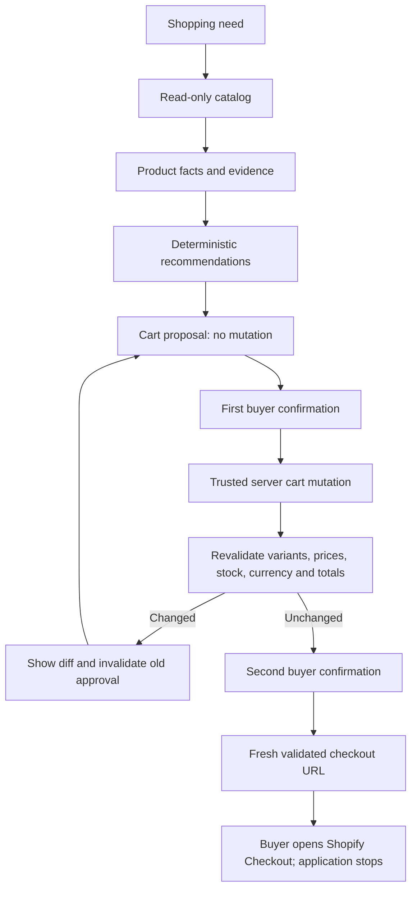

# Proof Cart

Evidence-backed shopping recommendations with human-confirmed cart mutations.

**Agent recommends. Buyer decides. Shopify completes checkout.**

Proof Cart is an independent, early-stage reference application for a buyer-facing
storefront built with Hydrogen, React Router, and strict TypeScript.
It is not affiliated with or endorsed by Shopify.

## Status

**M1 in progress: runnable foundation preview.** The credential-free application
serves an SSR home page with client hydration, safe route errors, and a responsive
keyboard-accessible shell. Search, catalog evidence, recommendations, cart actions,
and checkout handoff are not implemented yet. No live-store or release claim is made.

Follow the [roadmap](docs/roadmap.md), [execution state](docs/execution/state.md),
and [GitHub issues](https://github.com/zemeng2015/proof-cart/issues).
Current increment: [PC-01 — application scaffold and CI](https://github.com/zemeng2015/proof-cart/issues/1).

## Three principles

- **Facts:** every displayed price, availability, specification, and recommendation
  reason links to evidence. Missing facts appear as unknown.
- **Approval:** the planner uses read-only catalog tools. Only a trusted server can
  apply a validated proposal after an explicit, single-use buyer confirmation.
- **Handoff:** revalidate the cart and obtain a second confirmation before offering
  a fresh, merchant-allowlisted Shopify Checkout URL for the buyer to open.



## Development path

The first usable milestone is a credential-free fixture storefront with search,
product detail, comparison of at most three candidates, and an evidence drawer.
Deterministic planning comes first. An optional model provider must never gain
cart permissions or invent product facts.

Use Node **24.20.0** and npm **11.11.0**:

```sh
git clone https://github.com/zemeng2015/proof-cart.git
cd proof-cart
npm run setup
npm run demo:fixture
```

Open `http://127.0.0.1:4173`. Installation needs the npm registry; the running
fixture preview uses local assets and needs no Shopify account, token, or `.env`.

```sh
npm run typecheck
npm run lint
npm test
npm run build
npm run test:runtime
npx playwright install chromium
npm run test:e2e
```

See [local development](docs/development.md) for Linux browser dependencies,
port overrides, the pinned framework compatibility exceptions, and test scope.
These scaffold checks do not establish the complete cart, provenance, accessibility,
performance, or live-store acceptance targets in the charter.

## Project documents

- [Product charter and safety invariants](docs/charter.md)
- [Milestones and acceptance criteria](docs/roadmap.md)
- [Architecture](docs/architecture.md)
- [Threat model](docs/threat-model.md)
- [Local development and dependency baseline](docs/development.md)
- [Evidence and read-only planning decision](docs/adr/0001-evidence-and-read-only-planning.md)
- [Confirmation and checkout decision](docs/adr/0002-confirmation-and-checkout-boundary.md)
- [First sprint backlog](docs/execution/backlog.md)
- [Contribution guide](CONTRIBUTING.md), [security policy](SECURITY.md), and [code of conduct](CODE_OF_CONDUCT.md)

## Boundaries and license

No payment collection, order completion, automatic redirects, scraping, browser
automation, seller operations, or multi-merchant universal cart. Fixtures and
official commerce APIs are the only planned data sources. No production-readiness,
traffic-scale, or security guarantees are claimed by this initial design.

Released under the [MIT License](LICENSE). The project name is a working name;
repository creation is not trademark clearance.
