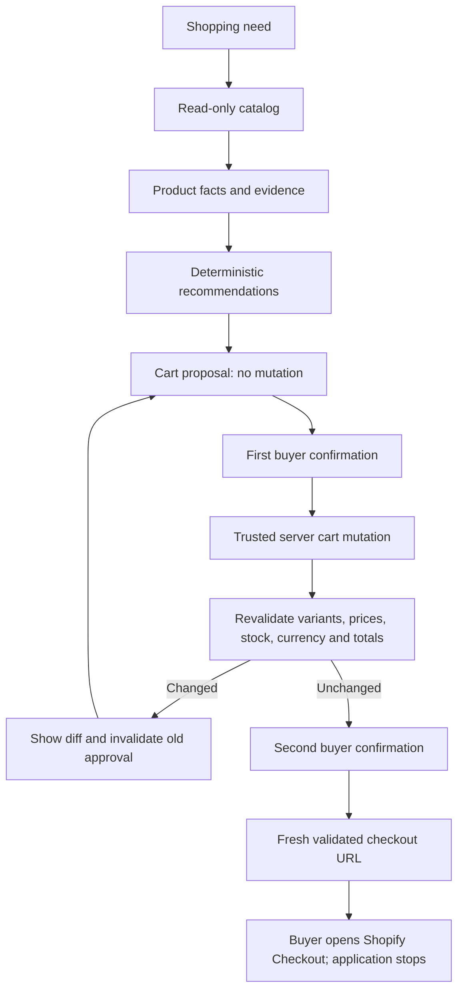

# Proof Cart

Evidence-backed shopping recommendations with human-confirmed cart mutations.

**Agent recommends. Buyer decides. Shopify completes checkout.**

Proof Cart is an independent, early-stage reference application for a buyer-facing
storefront. The planned stack is Hydrogen, React Router, and strict TypeScript.
It is not affiliated with or endorsed by Shopify.

## Status

**M0 complete: repository foundation.** The charter, roadmap, architecture decisions,
and development backlog are established. There is no runnable storefront,
live integration, demo, or release yet. Product tests and metrics have not run.

Follow the [roadmap](docs/roadmap.md), [execution state](docs/execution/state.md),
and [GitHub issues](https://github.com/zemeng2015/proof-cart/issues).
Next: [PC-01 — application scaffold and CI](https://github.com/zemeng2015/proof-cart/issues/1).

## Three principles

- **Facts:** every displayed price, availability, specification, and recommendation
  reason links to evidence. Missing facts appear as unknown.
- **Approval:** the planner uses read-only catalog tools. Only a trusted server can
  apply a validated proposal after an explicit, single-use buyer confirmation.
- **Handoff:** revalidate the cart and obtain a second confirmation before offering
  a fresh, merchant-allowlisted Shopify Checkout URL for the buyer to open.

## Development path

The first usable milestone is a credential-free fixture storefront with search,
product detail, comparison of at most three candidates, and an evidence drawer.
Deterministic planning comes first. An optional model provider must never gain
cart permissions or invent product facts.

There are no setup or demo commands in M0. M1 will add real `npm run setup`,
`npm run demo:fixture`, `npm test`, and `npm run test:e2e` commands, alongside
type checking, linting, and a production build. The clean-clone fixture setup
target is ten minutes or less; this has not yet been measured.

Repository hygiene can currently be checked with `git diff --check`. This is
not an application test or evidence that the safety design is implemented.

## Project documents

- [Product charter and safety invariants](docs/charter.md)
- [Milestones and acceptance criteria](docs/roadmap.md)
- [Architecture](docs/architecture.md)
- [Threat model](docs/threat-model.md)
- [Evidence and read-only planning decision](docs/adr/0001-evidence-and-read-only-planning.md)
- [Confirmation and checkout decision](docs/adr/0002-confirmation-and-checkout-boundary.md)
- [First sprint backlog](docs/execution/backlog.md)
- [Contribution guide](CONTRIBUTING.md), [security policy](SECURITY.md), and [code of conduct](CODE_OF_CONDUCT.md)

## Boundaries and license

No payment collection, order completion, automatic redirects, scraping, browser
automation, seller operations, or multi-merchant universal cart. Fixtures and
official commerce APIs are the only planned data sources. No production-readiness,
traffic-scale, or security guarantees are claimed by this initial design.

Released under the [MIT License](LICENSE). The project name is a working name;
repository creation is not trademark clearance.
