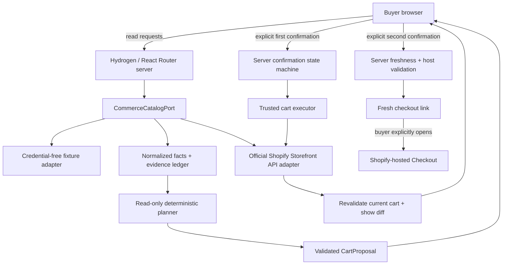

# Planned architecture

Status: fixture catalog routes, typed read adapters, evidence snapshots, and
data-only proposals are implemented. Deterministic planning is a tested domain
service; recommendation UI and confirmation execution remain planned. The [charter](charter.md) defines
product scope and stable invariants.

## Implemented foundation

`server.ts` rejects unsupported methods before invoking React Router, admits only
bounded same-origin urlencoded comparison POSTs, validates
fixture configuration, and gives loaders a minimal typed context. The public
loader emits an explicit field allowlist. Hydrogen supplies the Vite plugin,
React Router preset, nonce provider, and Oxygen worker integration; React Router's
handler is called directly to avoid instantiating a Storefront client or implicit
forwarding endpoints. The production CSP allows local resources and nonce-bearing
scripts. Framework error messages and request logging exclude arbitrary details.

The credential-free routes have SSR, hydration, safe error recovery, a skip link,
and responsive styles. They read synthetic catalog facts through the validated
catalog port; no cart or checkout calls exist. Comparison selection is represented
by up to three unique product IDs in the URL. The fetcher removal action validates
the form, re-reads the remaining products, and redirects to the canonical GET URL.
It creates no session, persistence, or approval authority. Read [local development](development.md)
for verified versions, compatibility exceptions, local transport limitations,
and the actual test commands.

## Components and trust boundaries



The browser controls presentation and expresses intent; it cannot authorize a
server transition by changing client state. Product text and API payloads are
untrusted inputs. The planner receives only validated catalog data through a
read-only registry; it has no reference to the executor, cart secrets, tokens, or
checkout tools. The trusted server alone validates and consumes approvals and
calls cart APIs. Shopify owns payment and order completion beyond the handoff.

## Proposed module responsibilities

| Module | Responsibility |
| --- | --- |
| Routes | SSR search/product/compare/cart-review/handoff, loaders/actions/fetchers, progressive error and loading states. |
| Catalog | `CommerceCatalogPort`; fixture and Storefront adapters; GraphQL codegen and typed domain mapping for products, variants, money, availability, and carts. |
| Evidence | Immutable observation records, claim-to-evidence references, evidence drawer, source freshness and derived-reason traceability. |
| Planner | Intent/output schemas, bounded read-only tools, deterministic selection and at most three candidates; at most one optional model behind the same contract later. |
| Cart | `CartProposal`, server discriminated-union state machine, diff/revalidation, trusted executor. |
| Security | Session binding, confirmation tokens, action idempotency, origin/CSRF checks, rate limits, secret redaction, URL validation. |
| Tests/evaluations | Unit and contract checks, fixed intents, adversarial cases, browser scenarios, accessibility and performance evidence. |

Prefer strict TypeScript, React Router server state, Zod validation, and small
typed provider ports. Framework versions are pinned in the scaffold; verify the
Storefront API version when implementing its adapter. No database, state
framework, or agent framework is selected.

## Facts, evidence, and planning

An evidence record is planned to contain `id`, `subjectId`, `fieldPath`, `value`,
`source`, `apiVersion`, `fetchedAt`, optional `canonicalUrl`, and `snapshotHash`.
Initial source types are fixture and Storefront API; a future adapter may add
catalog sources without weakening the contract. Observation metadata must reflect
the actual source and retrieval, not a fabricated live fetch.

UI claims reference evidence records. A recommendation reason may be a transparent
derivation over cited facts and user constraints; it must not turn a seller's
unsupported marketing claim into an established specification. Absent fields are
`unknown`, zero is not a substitute for missing price, and availability observations
are time-bound. The UI may display partial information, but an unknown critical
price/availability/variant prevents a confident actionable proposal until resolved.

The proposal schema includes `proposalId`, lines (`variantId`, positive bounded
`quantity`), `rationaleEvidenceIds`, `currency`, `priceSnapshotHash`, and `expiresAt`.
The authoritative server snapshot additionally contains normalized amounts, lines,
variant/availability observations, evidence references, and an opaque version or
fingerprint needed to validate confirmation. Never trust a browser-supplied amount
or fingerprint as evidence of current state. Money mapping must preserve currency
and exact decimal semantics; binary floating-point approximations cannot establish
approval equality.

## Server state and two confirmations

```text
DISCOVERING -> REVIEWING_RESULTS -> CART_PROPOSED
  -> AWAITING_CART_CONFIRMATION
  -> CART_APPLIED -> REVALIDATING
  -> AWAITING_HANDOFF_CONFIRMATION -> HANDOFF_READY

Relevant transitions may instead enter CHANGED, EXPIRED, or FAILED.
CHANGED requires a visible diff and renewed review/approval.
```

Each transition is checked server-side. First approval permits one precisely bound
cart action; it does not grant future mutations or checkout handoff. Second approval
permits handoff for the revalidated state; it does not permit payment or order
creation. A material change after either approval invalidates that approval. If
renewed review changes the proposed cart action, a new first approval is required.

At approval consumption, check session, action, normalized fingerprint, amount,
currency, expiry, and one-use state against trusted server values. Revalidate when
preparing the second confirmation and again when consuming it so that the interval
between rendering and clicking does not bypass stale-state checks. Obtain the
checkout URL freshly during the final handoff action and validate it before showing
an explicit buyer-operated link. Never navigate automatically.

## Atomicity, freshness, and failure handling

Confirmation consumption and logical action reservation must be atomic relative
to concurrent requests. A signed token alone cannot prevent replay. Expiry is not
an idempotency mechanism, and disabling a button is not concurrency control.
Repeated submissions of the same valid action return the known logical result;
changed parameters cannot reuse its idempotency key.

M2 must decide the authoritative session/token/action store and its deployment
semantics before enabling writes. A process-local store can demonstrate a bounded
single-process fixture flow, but cannot substantiate multi-instance or restart-safe
guarantees. Do not add a database by default; document the smallest justified
solution and its limitations. Also decide short TTL values, fingerprint
canonicalization, and retention for spent tokens and action records, with tests.

A Shopify timeout may occur after the remote mutation succeeds. Do not blindly
retry and create a second effect or mark an uncertain result successful. Track the
uncertain outcome and reconcile against trusted cart state, or fail closed with
explicit recovery. Partial GraphQL/user errors likewise need mapped failure states.

Cart state may change in another tab or outside this application. Serialize local
conflicting actions, detect version/fingerprint mismatch, and re-read authoritative
state around approval consumption. The exact Storefront concurrency capabilities
must be verified during adapter implementation. Revalidation narrows a race; it
does not reserve stock or guarantee a future checkout total. Shopify remains the
authority when the buyer opens checkout. Surface that limitation honestly.

## Secrets and checkout URLs

Prefer a Secure, HttpOnly, appropriately scoped/SameSite opaque session cookie;
cart IDs containing secret material and private Storefront tokens stay in
server-side storage and server-to-server calls. Redact sensitive query variables,
URLs, exception payloads, and telemetry. No cart secret enters HTML, serialized
loader data, browser request bodies, local storage, or logs.

Parse the freshly returned checkout URL with a URL parser. Require `https:`, exact
configured merchant hostname matching, no embedded user credentials, and only
approved port behavior. Reject malformed URLs and deceptive suffix/prefix matches.
Do not accept a browser-provided destination or follow arbitrary redirect targets.
Treat legitimate checkout links as sensitive transient output: do not log or persist
them unnecessarily. Define freshness expiry and regeneration behavior in M2.

## Verification and external references

Each adapter must meet the same contract against deterministic fixtures. Add real
Vitest/Testing Library, MSW, Playwright, axe, and Lighthouse commands with the
scaffold/features; retain raw output and distinguish fixture from authorized live
checks. The [threat model](threat-model.md) maps negative paths to invariants.

Official reference entry points for scaffold verification:
[Hydrogen fundamentals](https://shopify.dev/docs/storefronts/headless/hydrogen/fundamentals),
[Storefront API](https://shopify.dev/docs/api/storefront/latest), and
[cart management](https://shopify.dev/docs/storefronts/headless/building-with-the-storefront-api/cart/manage).
These links are reference entry points, not evidence that a baseline was verified.

Design decisions: [evidence and read-only planning](adr/0001-evidence-and-read-only-planning.md)
and [confirmation and checkout boundary](adr/0002-confirmation-and-checkout-boundary.md).
